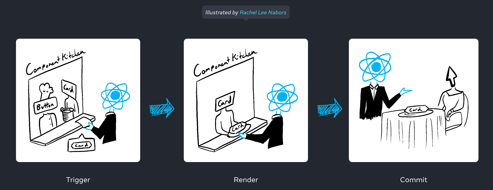
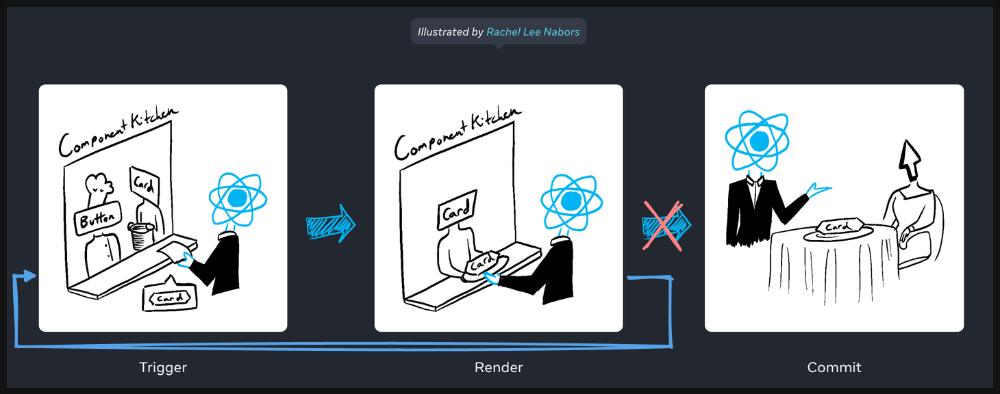
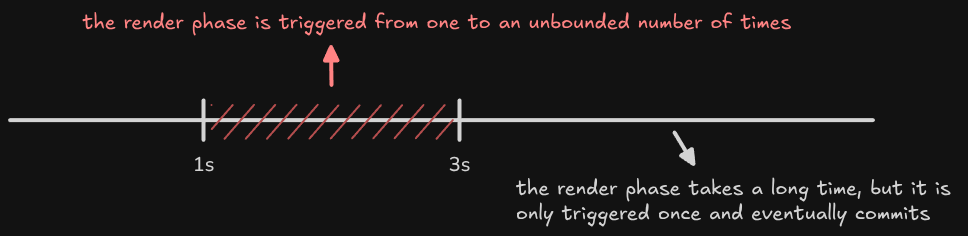

This occurs when the main thread is busy, but not maxed out. (You may need to adjust the `fib(n)` in `<Bar>` and `<Timer>` depending on your CPU performance.)


# Why this happens

React does not preserve any state for renders that got suspended before they were able to mount for the first time. When the component has loaded, React will retry rendering the suspended tree from scratch. (see the [official doc](https://react.dev/reference/react/Suspense#:~:text=React%20does%20not%20preserve%20any%20state%20for%20renders%20that%20got%20suspended%20before%20they%20were%20able%20to%20mount%20for%20the%20first%20time.%20When%20the%20component%20has%20loaded%2C%20React%20will%20retry%20rendering%20the%20suspended%20tree%20from%20scratch.))

Normally, React displays UI in three phases:

1. **Triggering** a render (delivering the guest’s order to the kitchen)
2. **Rendering** the component (preparing the order in the kitchen)
3. **Committing** to the DOM (placing the order on the table)



However, this flow changes for a **suspended tree**. When a component suspends, React may start rendering but then **discard the work before commit**. As a result, the render phase can run **from one to an unbounded number of times** before any commit happens. This leads to prolonged loading states and a poor user experience.



This is usually not an issue on modern, high-performance devices. However, on lower-end or resource-constrained devices, it can become a serious problem. Based on my observations, if the render phase of a suspended tree takes on the order of **1 to 3 seconds**, React is much more likely to **discard the work and retry**, significantly increasing the perceived loading time.



## Succeeds on the first load, but fails on subsequent attempts

In some cases, a suspended tree may load successfully the first time, but fail on subsequent attempts. There are several possible reasons for this behavior:

1. On the first load, the render path is **segmented by fetching split chunks** (for code splitting).
2. On the first load, the render path is **segmented by API requests** (to fetch server data).
3. On the first load, the render path may take **more than 3 seconds**, but on subsequent loads it completes within **1–3 seconds**, making it more likely to fall into the range where React discards and retries suspended work.

# Solutions

## Use `useEffect` for heavy work

```diff
function Bar() {
  console.log("render bar");

- const n = useMemo(() => {
-   console.log("bar fib(40)");
-   return fib(40);
- }, []);
+ const [n, setN] = useState(0);
+ useEffect(() => {
+   console.log("bar fib(40)");
+   setN(fib(40));
+ }, []);

  return (
    <RevealAfterCommit>
      <Suspense fallback="bar loading...">
        <Suspendable promiseId="bar">
          <h2>Bar</h2>
          <p>{n}</p>
        </Suspendable>
      </Suspense>
    </RevealAfterCommit>
  );
}
```

This would not work if the load comes from many small components rather than a few heavy computations.

## Reveal the `children` after commit

```diff
function Suspendable(props: { children: ReactNode; promiseId: string }) {
  if (!promiseGod.isResolve(props.promiseId)) {
    throw promiseGod.getPromise(props.promiseId);
  }
- return props.children;
+ return <RevealAfterCommit>{props.children}</RevealAfterCommit>;
}
```

```ts
function RevealAfterCommit(props: { children: ReactNode }) {
  const [revealed, setRevealed] = useState(false);

  useEffect(() => {
    setRevealed(true);
  }, []);

  if (!revealed) return null;
  return props.children;
}
```

This increases the number of commit phases for suspended components linearly.

From: trigger → render A → render B → commit

To: trigger → render A → commit → render B → commit
