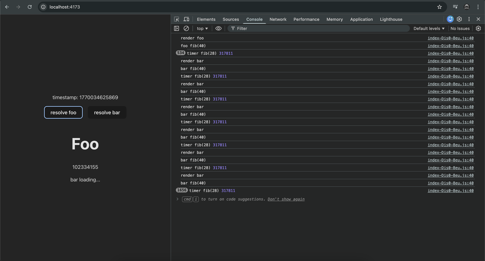

This occurs when the main thread is busy, but not maxed out. (You may need to adjust the `fib(n)` in `<Bar>` and `<Timer>` depending on your CPU performance.)




# Why this happens

React does not preserve any state for renders that got suspended before they were able to mount for the first time. When the component has loaded, React will retry rendering the suspended tree from scratch. (see the [official doc](https://react.dev/reference/react/Suspense#:~:text=React%20does%20not%20preserve%20any%20state%20for%20renders%20that%20got%20suspended%20before%20they%20were%20able%20to%20mount%20for%20the%20first%20time.%20When%20the%20component%20has%20loaded%2C%20React%20will%20retry%20rendering%20the%20suspended%20tree%20from%20scratch.))

# Solutions

## Use `useEffect` for heavy work

```diff
function Bar() {
  console.log("render bar");

- const n = useMemo(() => {
-   console.log("bar fib(40)");
-   return fib(40);
- }, []);
+ const [n, setN] = useState(0);
+ useEffect(() => {
+   console.log("bar fib(40)");
+   setN(fib(40));
+ }, []);

  return (
    <RevealAfterCommit>
      <Suspense fallback="bar loading...">
        <Suspendable promiseId="bar">
          <h2>Bar</h2>
          <p>{n}</p>
        </Suspendable>
      </Suspense>
    </RevealAfterCommit>
  );
}
```

## Reveal the `children` after commit

```diff
function Suspendable(props: { children: ReactNode; promiseId: string }) {
  if (!promiseGod.isResolve(props.promiseId)) {
    throw promiseGod.getPromise(props.promiseId);
  }
- return props.children;
+ return <RevealAfterCommit>{props.children}</RevealAfterCommit>;
}
```

```ts
function RevealAfterCommit(props: { children: ReactNode }) {
  const [revealed, setRevealed] = useState(false);

  useEffect(() => {
    setRevealed(true);
  }, []);

  if (!revealed) return null;
  return props.children;
}
```
